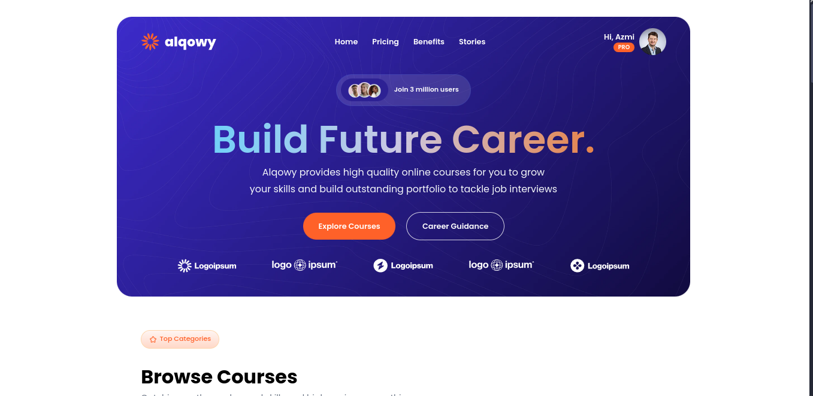
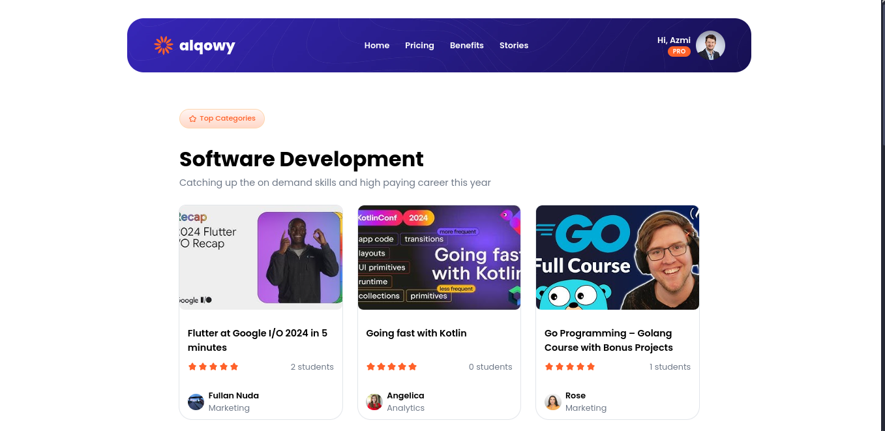
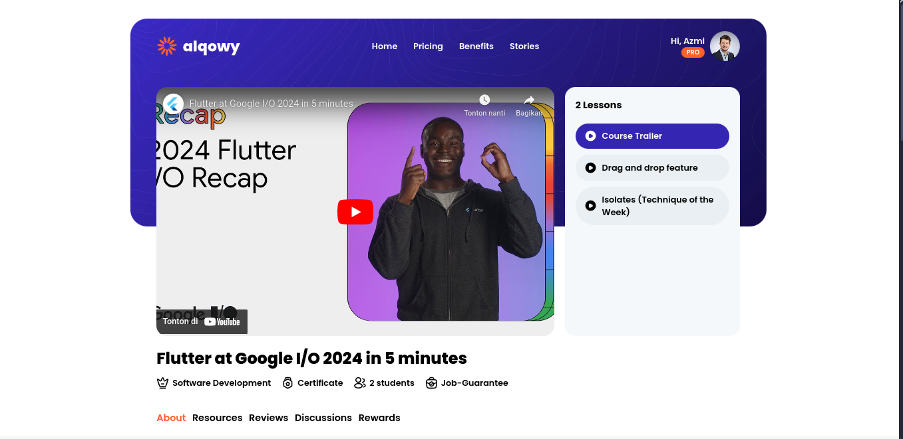
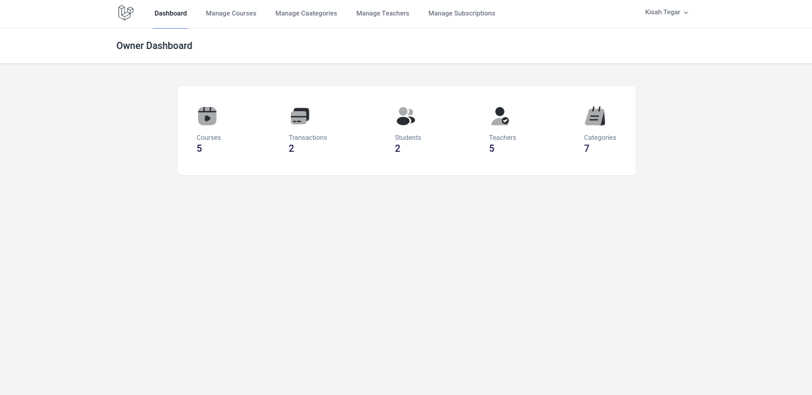
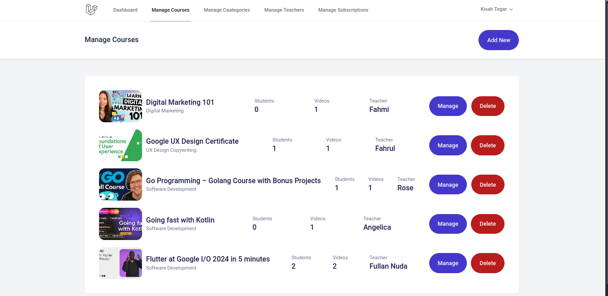
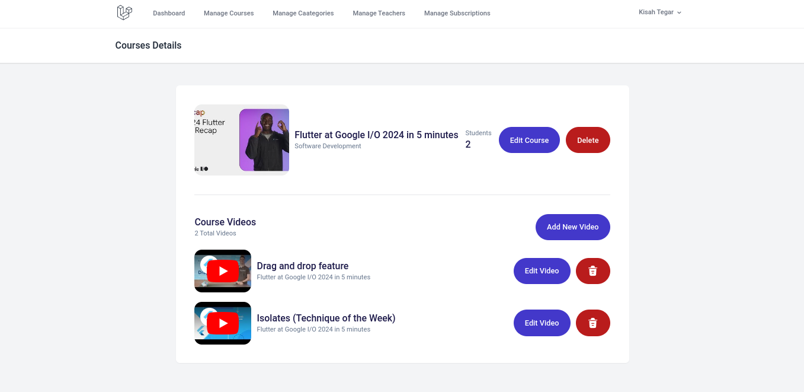
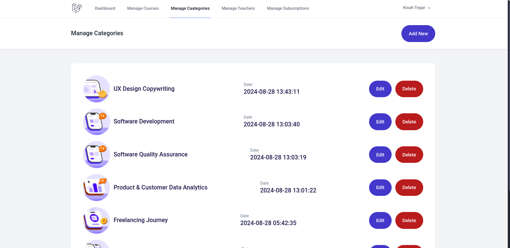
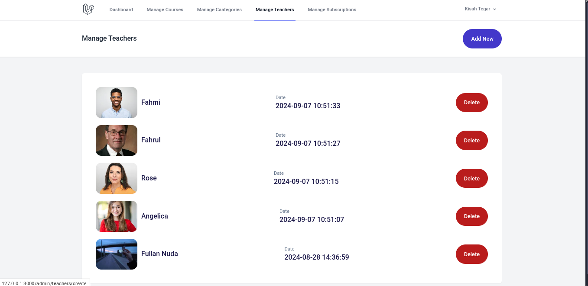
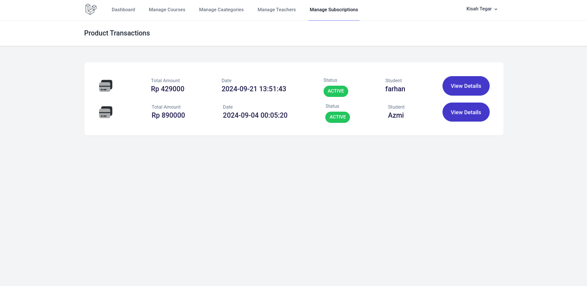

<p align="center"><a href="https://laravel.com" target="_blank"></a></p>

<p align="center">
<a href="https://github.com/laravel/framework/actions"></a>
<a href="https://packagist.org/packages/laravel/framework"></a>
<a href="https://packagist.org/packages/laravel/framework"></a>
<a href="https://packagist.org/packages/laravel/framework"></a>
</p>

---

# Alqowy Learning Platform

### A simple learning platform built with Laravel and Tailwind CSS.

<!--  -->

---

## Table of Contents

1. [Project Overview](#project-overview)
2. [Features](#features)
3. [Database Design (ERD)](#database-design)
4. [Installation](#installation)
5. [Running the Project](#running-the-project)
6. [Dependencies](#dependencies)
7. [Usage](#usage)
8. [Contributing](#contributing)
9. [License](#license)

---

## Project Overview

Alqowy is a simple learning platform where users can browse and enroll in courses. It supports multiple user roles (students, teachers, and admins) and provides a subscription-based system for access to content.

This project utilizes:
- **Laravel**: as the backend framework.
- **Tailwind CSS**: for front-end styling.
- **MySQL**: for the database.
- **Blade**: for rendering views.
- **Spatie Laravel Permission**: for handling user roles and permissions.

---

## Features

- **User Authentication**: Role-based access (admin/teacher/student).
- **Course Management**: Teachers can create and manage courses.
- **Subscription System**: Users can subscribe to courses through a checkout process.
- **Category Browsing**: Courses are categorized for easy navigation.
- **Responsive Design**: Styled using Tailwind CSS for mobile-first support.
- **Dashboard**: Admins can view stats like total users, courses, and transactions.

---

## Database Design (ERD)

Here’s a visual representation of the database schema.


- **Tables**:
  - `users`: Stores user info, roles, and authentication data.
  - `courses`: Stores course details.
  - `categories`: Stores course categories.
  - `subscribe_transactions`: Tracks subscription and payment details.

---

## Installation

### Prerequisites

- **PHP**: Version 8.2 or higher.
- **Composer**: Dependency manager for PHP.
- **MySQL**: Database engine.
- **Node.js & npm**: For managing front-end dependencies.

### Steps to Install

1. **Clone the Repository**:
   ```bash
   git clone https://github.com/yourusername/alqowy.git
   cd alqowy
   ```

2. **Install PHP Dependencies**:
   Install back-end dependencies via Composer:
   ```bash
   composer install
   ```

3. **Install Front-end Dependencies**:
   Install Tailwind CSS and other front-end packages:
   ```bash
   npm install
   npm run dev
   ```

4. **Set Up Environment**:
   Copy the example `.env` file:
   ```bash
   cp .env.example .env
   ```

   Update the database configuration in `.env`:
   ```bash
   DB_DATABASE=alqowy
   DB_USERNAME=root
   DB_PASSWORD=yourpassword
   ```

5. **Generate Application Key**:
   ```bash
   php artisan key:generate
   ```

6. **Run Migrations**:
   ```bash
   php artisan migrate --seed
   ```

7. **Start the Development Server**:
   ```bash
   php artisan serve
   ```

---

## Running the Project

Once installed, access the project by visiting:

```
http://localhost:8000
```

To compile front-end assets and watch for changes:

```bash
npm run watch
```

---

## Dependencies

The project depends on the following packages, as specified in `composer.json`:

### Required Packages:
- **PHP**: `^8.2`
- **Laravel Framework**: `^11.9`
- **Laravel Tinker**: `^2.9` (for interacting with your application)
- **Spatie Laravel Permission**: `^6.9` (for role-based permissions)

### Dev Dependencies:
- **FakerPHP**: `^1.23` (for generating fake data)
- **Laravel Breeze**: `^2.1` (for setting up simple auth scaffolding)
- **Laravel Pint**: `^1.17` (for code style checks)
- **Laravel Sail**: `^1.26` (for running Laravel in Docker)
- **Mockery**: `^1.6` (for testing)
- **PHPUnit**: `^11.0.1` (for testing)

---

## Usage

### Roles and Access:
- **Admin**: Manages courses, categories, and subscriptions.
- **Teacher**: Can create and manage courses.
- **Student**: Can browse, subscribe, and learn from available courses.

### Authentication:
- The platform includes a role-based access system using the `spatie/laravel-permission` package. You can assign roles such as "admin," "teacher," or "student."

---

## Screenshots

### Front





### Admin









---

## Contributing

Contributions are welcome! Please follow these steps:

1. Fork the project.
2. Create a new branch (`git checkout -b feature/my-feature`).
3. Commit your changes (`git commit -m 'Add feature'`).
4. Push the branch (`git push origin feature/my-feature`).
5. Submit a pull request.

---

## ✨ About Us

- 💻 All of my projects are available at [github.com/kisahtegar](https://github.com/kisahtegar)
- 📫 How to reach me **<code.kisahtegar@gmail.com>**
- 📄 Know about my experiences [kisahcode.web.app](https://kisahcode.web.app)
